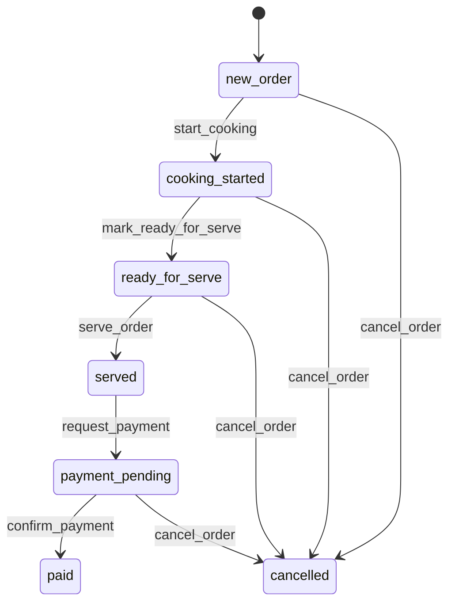

# Отчет по лабораторной работе

## Описание задания

Требуется спроектировать управляющий конечный автомат для предметной области **"Очередь заказов в ресторане"**, определить:

- возможные состояния и переходы между ними;
- входные события (триггеры), инициирующие переходы;
- выходные сигналы, формируемые автоматом;
- диаграмму переходов;
- программную реализацию на Python с использованием библиотеки `finite-state-machine`.

## Описание реализации конечного автомата

Реализация выполнена в файле `restaurant_order_fsm.py` на основе библиотеки `finite-state-machine` (https://github.com/alysivji/finite-state-machine).

### 1) Состояния автомата

Используются следующие состояния:

1. `new_order` — новый заказ принят;
2. `cooking_started` — заказ передан на кухню и готовится;
3. `ready_for_serve` — блюдо готово к выдаче;
4. `served` — заказ выдан гостю;
5. `payment_pending` — ожидается оплата;
6. `paid` — заказ оплачен (конечное успешное состояние);
7. `cancelled` — заказ отменен (конечное альтернативное состояние).

### 2) Входные события (триггеры)

Каждый переход задается декоратором `@transition(source=..., target=...)`:

- `start_cooking`: `new_order -> cooking_started`
- `mark_ready_for_serve`: `cooking_started -> ready_for_serve`
- `serve_order`: `ready_for_serve -> served`
- `request_payment`: `served -> payment_pending`
- `confirm_payment`: `payment_pending -> paid`
- `cancel_order`: `[new_order, cooking_started, ready_for_serve, payment_pending] -> cancelled`

### 3) Выходные сигналы

На каждом валидном переходе формируется выходной сигнал:

- `kitchen_ticket_sent`
- `dish_ready_notification`
- `order_served_notification`
- `invoice_generated`
- `payment_accepted`
- `order_cancelled`

Сигналы фиксируются в журнале `signals` и выводятся в консоль.

### 4) Обработка ошибок

При попытке выполнить недопустимый переход библиотека генерирует исключение `TransitionNotAllowed`. В демонстрации обрабатывается кейс вызова `confirm_payment` из состояния `new_order`.

## Диаграмма переходов

Диаграмма в формате Mermaid:

## Выводы

В ходе работы спроектирован и реализован управляющий конечный автомат для очереди заказов в ресторане. Автомат содержит более 5 состояний, поддерживает как основной успешный сценарий (`new_order -> ... -> paid`), так и альтернативный сценарий отмены (`-> cancelled`).

Использование декораторов `@transition` из `finite-state-machine` позволило сделать таблицу переходов явной и компактной, а также обеспечить строгий контроль корректности переходов между состояниями.
